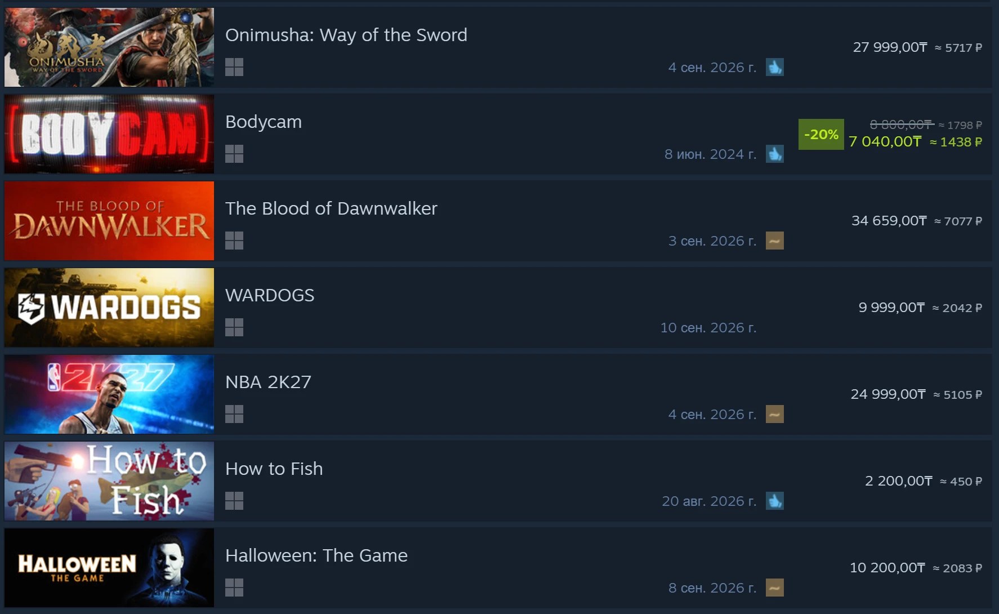
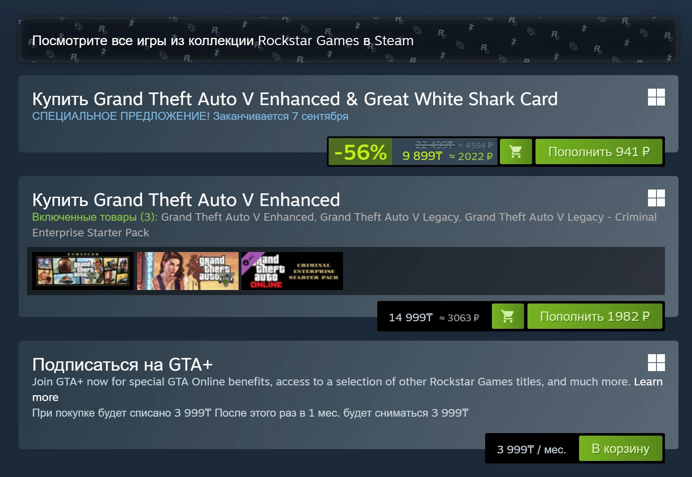
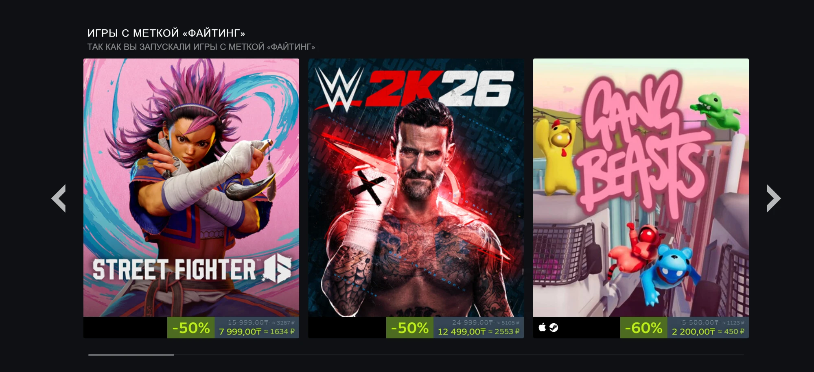
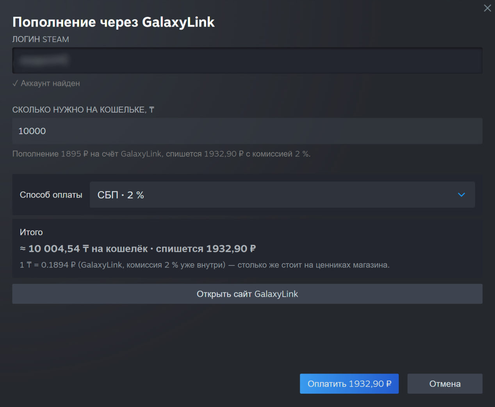
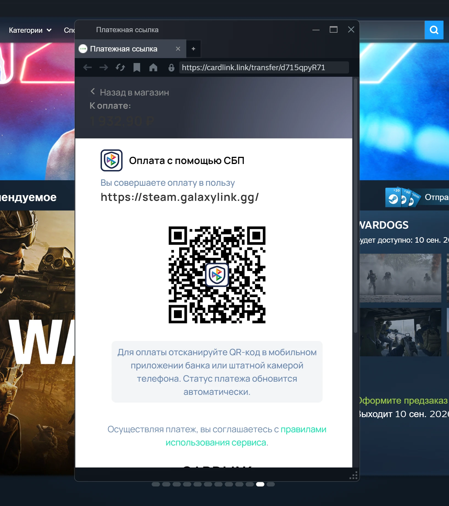

# Steam Price Converter

Цены магазина Steam в рублях — рядом с оригинальной ценой, какой бы регион ни был у аккаунта.

Рубли на ценнике это **конечная сумма**, а не «примерно по курсу ЦБ»: внутри уже и курс посредника, через
которого пополняется кошелёк, и его комиссия. Сколько написано — столько и спишется.

**[⬇ Скачать последнюю версию](../../releases/latest)**

## Цена в рублях у каждой игры

Плагин не трогает цены Steam — он дописывает рядом вторую, ту, что вы реально заплатите. Скидки считаются от
уже сниженной цены, зачёркнутая старая тоже переводится.

## Не хватает на кошельке — видно, сколько докинуть

На странице игры, когда денег не хватает, родная кнопка «В корзину» сжимается до иконки, а рядом встаёт зелёная
**«Пополнить N ₽»** — ровно на недостающую сумму именно этой покупки, а не «на глазок». У каждого варианта
издания она своя.

## Любая раскладка карточек

Карусели, подборки «потому что вы играли», списки новинок, поиск, корзина — везде, где Steam печатает цену.

## Окно пополнения

Вводите, **сколько нужно на кошельке** в своей валюте, — плагин сам считает рубли. Логин Steam подставляется из
аккаунта и проверяется до оплаты (у тех посредников, кто это умеет). Видно и то, сколько зачислится, и то,
сколько спишется, — до копейки.

## Оплата не выходя из Steam

Платёжная страница открывается в собственном браузере клиента — с адресной строкой, замком и видимым доменом
получателя, а не в безымянном окне. СБП платится по QR, карта проходит целиком внутри, включая 3-D Secure.

## Посредники

Плагин **не принимает и не переводит деньги** — он считает цену и открывает страницу выбранного посредника.
Их два, переключаются в настройках:

| Посредник | Как платится | Что с ценой |
|---|---|---|
| **GalaxyLink** | плагин сам создаёт оплату, СБП или карта | курс близок к ЦБ, комиссия 2 % (СБП) или 4 % (карта) |
| **Т-Банк**, «Steam: РФ или СНГ аккаунт» | форма банка, открывается в браузере | комиссии сверху нет, наценка внутри курса (~7 %) |

Что выгоднее — видно прямо на ценнике: переключите посредника и сравните числа. Выбор и риск ваши.

## Установка

Всё нужное — в [релизе](../../releases/latest), там же пошаговая инструкция.

Коротко: для клиента Steam нужен [Millennium](https://steambrew.app) v3.4+, после него файл `.star` кладётся
в `<папка Steam>\millennium\plugins\` и включается в меню **Steam → Millennium → Плагины**.
Для браузера — файл `.user.js` открывается в Tampermonkey.

## Что важно знать

- Кнопки пополнения работают только в клиенте Steam: в браузере расширение не видит баланс кошелька.
- В браузере доступен только GalaxyLink — курс Т-Банка собирается из двух источников, это умеет лишь плагин.
- Пополнение приходит в валюте вашего кошелька Steam. Если на аккаунте ещё не было платежей, Steam может сменить
  регион и валюту — это поведение самого Steam, а не плагина.
- Плагин ничего не знает о ваших платёжных данных: он открывает страницу посредника, дальше вы платите сами.

## Лицензия

MIT.
